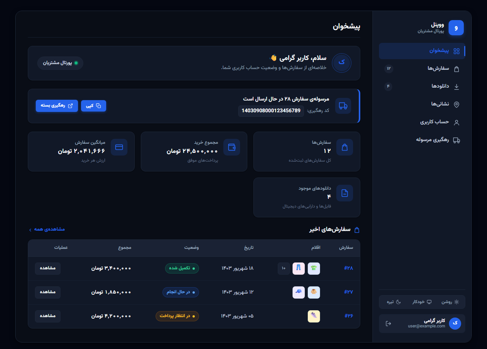
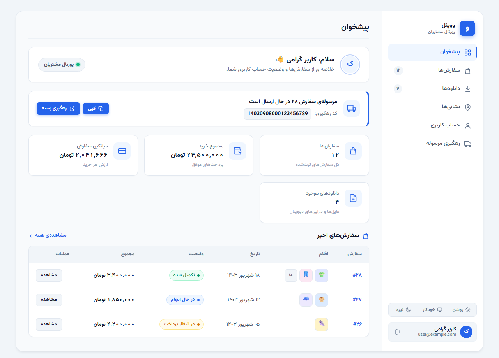
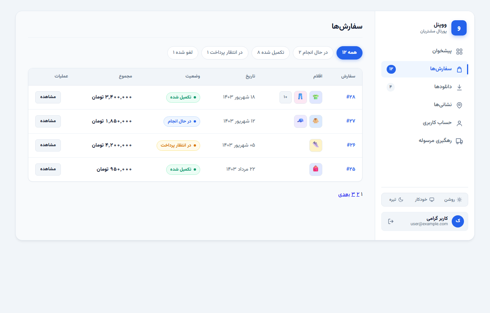
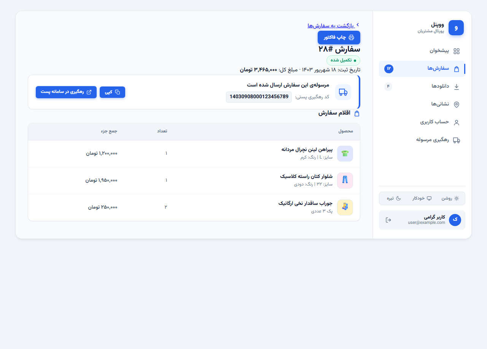
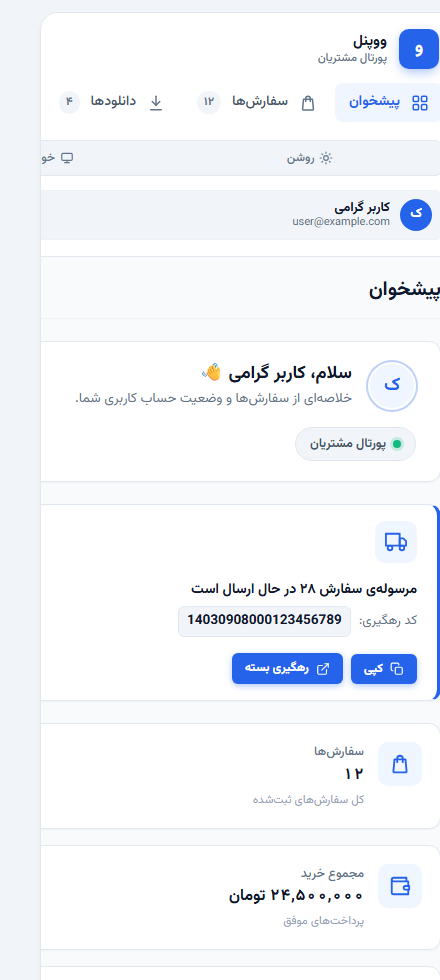

<div dir="rtl">

<p align="center">
  
</p>

# ووپنل (WooPanel) — پنل کاربری مدرن و اختصاصی برای ووکامرس

<p align="right">
  <a href="https://github.com/Majidygh/woopanel/releases"></a>
  <a href="https://woocommerce.com/"></a>
  <a href="https://wordpress.org/"></a>
  <a href="https://php.net/"></a>
  
  
</p>

**ووپنل** یک پنل کاربری فوق‌العاده مدرن، سبک و با دیزاین اختصاصی برای فروشگاه‌های ووکامرسی است که ناحیهٔ سنتی «حساب کاربری من» (My Account) را به یک پورتال حرفه‌ای، شیک و منظم تبدیل می‌کند.

طراحی نسخهٔ ۱.۷ با فاصله گرفتن از المان‌های تکراری، گرادیان‌های اغراق‌شده و افکت‌های سنگین هوش مصنوعی، بر پایهٔ یک **دیزاین سیستم اختصاصی صنعتی و مینیمال (Bespoke Slate & Obsidian)** بازنویسی شده است.

---

## ویژگی‌های کلیدی نسخه ۱.۷

* 💎 **دیزاین اختصاصی و مهندسی‌شده (Bespoke UI)**: طراحی تمیز با سطوح عمیق ابسیدین (`#090d16`) در دارک‌مود، سایه‌های نرم لایه‌ای در لایت‌مود و تایپوگرافی چشم‌نواز با فونت وزیرمتن.
* 🚚 **نوار هوشمند رهگیری مرسوله پستی**: نمایش مستقیم بسته در حال ارسال در بالای پیشخوان با کد رهگیری پست (`post_barcode`)، حفظ ارقام لاتین برای جلوگیری از مخدوش شدن بارکد، و انتقال با یک کلیک به سامانه رهگیری رسمی پست (`tracking.post.ir`).
* 🖼️ **پیش‌نمایش بصری اقلام سفارش (Order Thumbnails)**: نمایش تصاویر بندانگشتی کالاهای خریداری‌شده در ردیف‌های سفارش به همراه شمارشگر اقلام.
* 🖨️ **چاپ سریع فاکتور (Print Invoice)**: دکمه چاپ سفارش در نمای فاکتور به همراه استایل‌های بهینه‌سازی‌شده برای پرینت (`@media print`) و خروجی PDF تمیز بدون منوها.
* 🌓 **سوئیچر سه‌حالته تم**: پشتیبانی از حالت‌های **روشن (Light)**، **تیره (Dark)** و **خودکار (Auto)** متصل به ترجیحات سیستم‌عامل کاربر.
* ⚡ **بهینه‌سازی حداکثری عملکرد**: حذف کامل لیسنرهای سنگین موس و انیمیشن‌های پردازنده‌بر؛ اجرای روان ۶۰ فریم بر ثانیه با صفر کیلوبایت وابستگی به فریم‌ورک‌های سنگین جاوااسکریپت.
* 🇮🇷 **بومی‌سازی کامل و راست‌چین استاندارد**: ترجمه ۱۰۰٪ فارسی همراه با فایل‌های کامپایل‌شده `.mo/.po` و استایل‌های بهینه‌سازی‌شده `woopanel-rtl.css`.
* 🛡️ **امنیت سخت‌گیرانه**: تمام فرم‌ها با اعتبارسنجی Nonce، الگوی امن PRG، جلوگیری از نشت اطلاعات در URL و بررسی سختگیرانهٔ دسترسی کاربر به سفارش‌ها.

---

## تصاویر محیط کاربری

### ۱. پیشخوان در حالت روشن (Light Mode)
طراحی شیک، کارت‌های آماری خلوت، نوار رهگیری مرسوله فعال و جدول سفارش‌های اخیر با ریزعکس کالاها:

<p align="center">
  
</p>

### ۲. پیشخوان در حالت تیره (Obsidian Dark Mode)
پالت رنگی لوکس با مشکی عمیق ابسیدین، تفکیک ملایم لایه‌ها و کاهش خستگی چشم در محیط‌های کم‌نور:

<p align="center">
  
</p>

### ۳. بخش سفارش‌ها و فیلترهای وضعیت
فیلترهای کپسولی وضعیت سفارش‌ها، تاریخچه خرید، ریزعکس محصولات و صفحه‌بندی هوشمند:

<p align="center">
  
</p>

### ۴. جزئیات سفارش و چاپ فاکتور
نمایش کامل اقلام، سایز و رنگ، جمع مبالغ، وضعیت بسته و دکمه اختصاصی پرینت فاکتور:

<p align="center">
  
</p>

### ۵. ریسپانسیو و نمای موبایل
چیدمان ارگونومیک، سازگار با انواع ابعاد نمایشگرها و تبلت‌ها:

<p align="center">
  
</p>

---

## بخش‌های پنل در یک نگاه

| بخش | امکانات و توضیحات |
| :--- | :--- |
| **پیشخوان** | خوش‌آمدگویی، نوار رهگیری بستهٔ فعال، ۴ کارت آماری (تعداد سفارش، مجموع خرید، میانگین فاکتور، دانلودها)، جدول سفارش‌های اخیر |
| **سفارش‌ها** | تاریخچه سفارشات، فیلتر آنی بر اساس وضعیت (در حال انجام، تکمیل شده، لغو شده و...)، پیش‌نمایش بندانگشتی کالاها، صفحه‌بندی |
| **جزئیات سفارش** | فاکتور رسمی اقلام با متغیرها (سایز، رنگ)، خلاصه مالی، اطلاعات تحویل، کارت رهگیری پستی و دکمه چاپ |
| **رهگیری مرسوله** | لیست تمام مرسوله‌های دارای کد رهگیری، کپی سریع کد با فیدبک بصری و اتصال مستقیم به شرکت ملی پست |
| **دانلودها** | مدیریت فایل‌های دیجیتال و دانلودی با شمارشگر دفعات باقی‌مانده و تاریخ انقضا |
| **نشانی‌ها** | ویرایش درجا و تمیز آدرس‌های صورت‌حساب و تحویل با فیلدهای استاندارد ووکامرس |
| **حساب کاربری** | ویرایش نام، نام خانوادگی، ایمیل و تغییر امن کلمه عبور با تأیید رمز فعلی |

---

## راهنمای نصب و راه‌اندازی

1. آخرین نسخهٔ آماده را از بخش **[Releases گیت‌هاب](https://github.com/Majidygh/woopanel/releases)** (فایل `woopanel-v1.7.0.zip`) دانلود کنید.
2. در پیشخوان وردپرس به مسیر **افزونه‌ها ← افزودن افزونه ← بارگذاری افزونه** بروید و فایل زیپ را آپلود و فعال کنید.
3. **انتخاب نحوه نمایش**:
   * **حالت خودکار (پیشنهادی)**: ووپنل به‌صورت پیش‌فرض جایگزین صفحهٔ «حساب کاربری من» ووکامرس می‌شود و نیازی به تغییر دستی نیست.
   * **استفاده با شورت‌کد**: شورت‌کد `[woopanel]` را در هر برگه‌ای که می‌خواهید قرار دهید. برای باز کردن یک تب خاص:
     ```text
     [woopanel view="orders"]
     [woopanel view="tracking"]
     ```

---

## هوک‌ها و فیلترهای توسعه‌دهندگان

ووپنل طوری توسعه داده شده که بدون دستکاری در هسته، قابل شخصی‌سازی باشد:

```php
// افزودن آیتم جدید به سایدبار پنل
add_filter( 'woopanel_nav_items', function( $items, $user_id ) {
    $items['support'] = array(
        'label'  => 'پشتیبانی تیکت',
        'icon'   => 'chat',
        'url'    => home_url( '/support/' ),
        'active' => false,
        'badge'  => '2',
    );
    return $items;
}, 10, 2 );

// سفارشی‌سازی ردیف‌های رهگیری پستی
add_filter( 'woopanel_tracking_rows', function( $rows, $user_id ) {
    // امکان اتصال متای شرکت‌های پستی اختصاصی مانند چاپار یا تیپاکس
    return $rows;
}, 10, 2 );
```

---

## پیش‌نیازها

* **وردپرس**: نسخه ۶.۰ یا بالاتر
* **ووکامرس**: نسخه ۷.۰ یا بالاتر (سازگار کامل با HPOS)
* **پی‌اچ‌پی**: نسخه ۷.۴ یا بالاتر (تست‌شده روی PHP 8.1 و 8.2 و 8.3)

---

## لایسنس

این پروژه تحت لایسنس **[GPL-2.0-or-later](LICENSE)** منتشر شده است.  
توسعه‌داده‌شده تحت مجوز گنو · [مخزن گیت‌هاب](https://github.com/Majidygh/woopanel).

</div>

---

# English Overview

**WooPanel** is a bespoke, lightweight, and ultra-modern customer account portal for WooCommerce. It seamlessly replaces the legacy WooCommerce "My Account" area with an elegant, craft-inspired interface.

### Highlights:
* **Bespoke UI Design**: Eliminates generic AI tropes in favor of an obsidian dark and crisp slate layout.
* **Smart Active Shipment Tracking**: Shows an alert banner when an order has an active tracking code with direct integration to postal tracking.
* **Order Item Visual Thumbnails**: Product thumbnails directly visible inside order tables and invoices.
* **1-Click Print Invoice**: Print-optimized stylesheet for crisp paper invoices and PDF saving.
* **3-Way Theme Switcher**: Light, Dark, and OS-synced Auto mode.
* **Zero JavaScript Dependencies**: High performance, server-rendered PHP, clean and secure.
* **Full RTL & Persian Localization**: Built-in Vazirmatn font, Persian numerals, and complete translation catalogs.

### Installation:
Download the latest `woopanel-v1.7.0.zip` from the [Releases](https://github.com/Majidygh/woopanel/releases) tab and upload it via **WordPress Admin → Plugins → Add New → Upload Plugin**.
